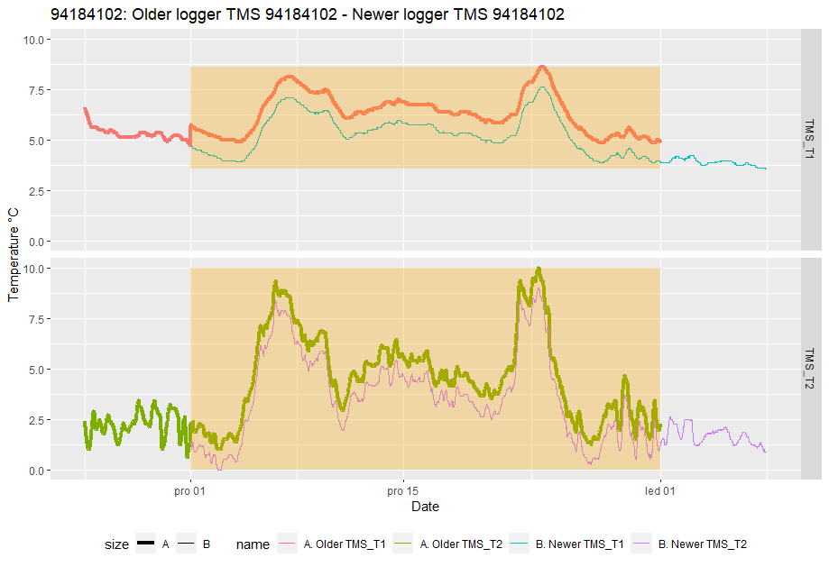

```{r, include = FALSE,purl=FALSE}
knitr::opts_chunk$set(
  collapse = TRUE,
  comment = "#>"
)
```


```{r,eval=FALSE,include=FALSE,comment='',purl=TRUE}

# === First install dependencies ===
requiered_packages <- c("purrr", "stringr", "lubridate", "plotly", "myClim", "shiny", "shinyjs", "dplyr", "DT", "tibble", "shinythemes")
missing_packages <- requiered_packages[!(requiered_packages %in% installed.packages()[,"Package"])]
if(length(missing_packages)) install.packages(missing_packages)

if(!("shinyTree" %in% installed.packages()[,"Package"])) {
    remotes::install_github("shinyTree/shinyTree")
}

# === Install myClimGui ===
install.packages("http://labgis.ibot.cas.cz/myclim/myClim_latest.tar.gz", repos=NULL, build_vignettes=TRUE)

```

## Reading Microclimatic Data
myClim natively supports the import of several pre-defined loggers. You can view the list of pre-defined loggers using `names(myClim::mc_data_formats)`. To specify the data format when reading files, set the `dataformat_name` parameter. There is also the possibility to read user-defined loggers by defining the `user_data_formats` parameter. For examples of how to read custom loggers in myClim, please refer to a separate vignette. Alternatively, myClim can read records from any wide or long data frame in R.

**The mc_read_files(), mc_read_wide(), and mc_read_long()** functions can be used for reading in data without metadata. These functions are user-friendly, fast, and allow for exploratory data analysis. myClim automatically organizes data into artificial localities, and metadata can be updated at a later stage. To organize records into real localities and provide metadata, use the **mc_read_data()** function along with two tables:1. A table that specifies logger file paths, data format name, logger type, and locality. 2. A table that provides locality metadata, such as coordinates, elevation, time offset to UTC, and so on.

* **Info functions:** For data overview use:

  * `mc_info_count()` which returns the number of localities, loggers and sensors in myClim object
  * `mc_info()` returning data frame with summary per sensor
  * `mc_info_meta()` returning the data frame with locality metadata
  * `mc_info_clean()` returning the data frame with cleaning log


